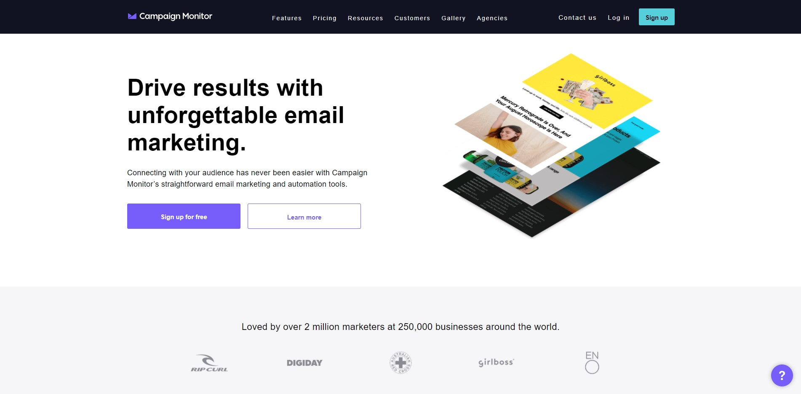
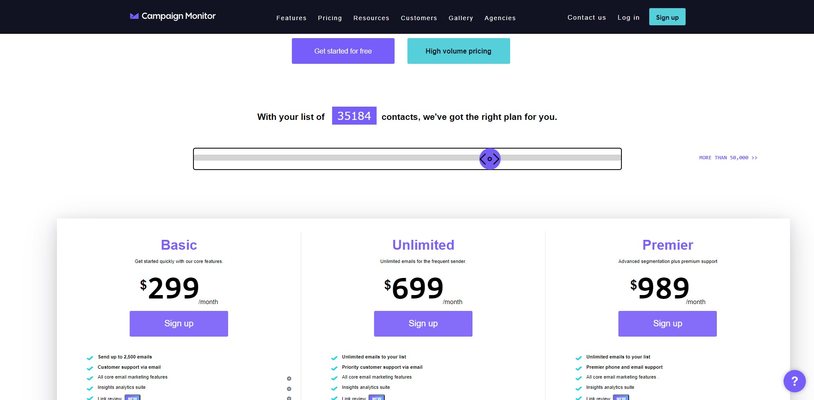
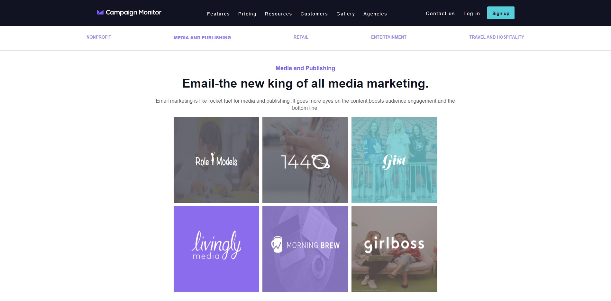
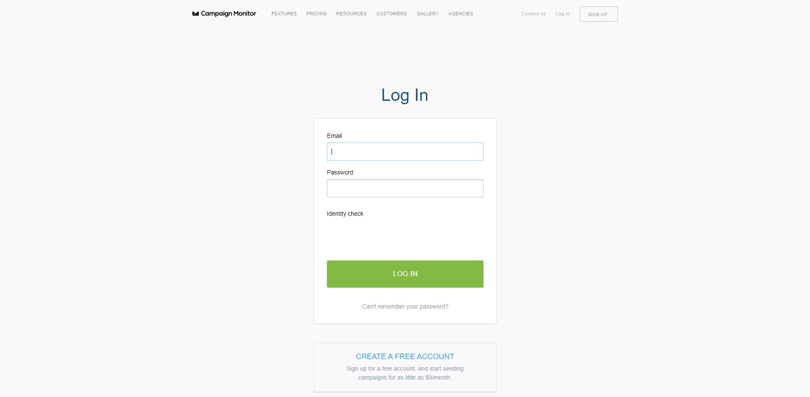

<h1 align="center">Welcome to Chromium 👋</h1>

<strong>Campaign Monitor</strong> is a web app that allows its users to capture data to an online mailing list, manage it, and send HTML e-newsletters to it. It's a 'software as a service' tool, meaning you don't own the app but pay a monthly fee to use it.

In this project we have tried to clone the front end of <strong>Campaign Monitor</strong>. With our efforts and the technology stack, that we have learned so far in the masai school, we were able to clone the front end with high precision and quality.

<br/>

- This is a Clone of the Campaign Monitor website
- and it was made in 1 week.
- The technologies used are beginner friendly and easy to use.
- If you are interested in contributing to this project feel free to do so.

# Dependencies and Tech stack used 💻

1. [HTML](https://html.com/)
1. [CSS](https://www.w3schools.com/css/)
1. [JavaScript](https://www.javascript.com/)

### 🏠 [Homepage](https://chromium-project.herokuapp.com/)

<br/>

# Features ✨

1. Animations using CSS and JavaScript
1. Dynamic price selection
1. Single page smooth scrolling

<br/>

# How to run the project 📑

### After cloning the project from https://github.com/PA-iscar/Chromium_project.git

## Install using

```
no installations required all the requirements are included in the repository
```

## Usage

```sh
just clone it and start using
```

   <br/>
   <br/>

# Highlights 📷

## Home



## Pricing



## Customers



## Login



---

<br/>

## Authors

👤 **Abhishek**

- Website: [Portfolio](https://abhi-aro.tech/)
- Github: [@PA-iscar](https://github.com/PA-iscar)
- LinkedIn: [@abhi-aro](https://linkedin.com/in/abhi-aro)

👤 **Kundan**

<!-- - Website: [Portfolio](https://sachin-gupta.netlify.app/) -->
- Github: [@kundan9724](https://github.com/kundan9724)
<!-- - LinkedIn: [@sachin-gupta-282a57220](https://www.linkedin.com/in/sachin-gupta-282a57220/) -->

👤 **Nikhil Kumar**

- Website: [Portfolio](https://nikhilsportfolio.netlify.app/)
- Github: [@12NikhilKumar](https://github.com/12NikhilKumar)
- LinkedIn: [@nikhil-kumar-520300218](https://www.linkedin.com/in/nikhil-kumar-520300218/)

## Show your support

Give a ⭐️ if you liked this project!

---
